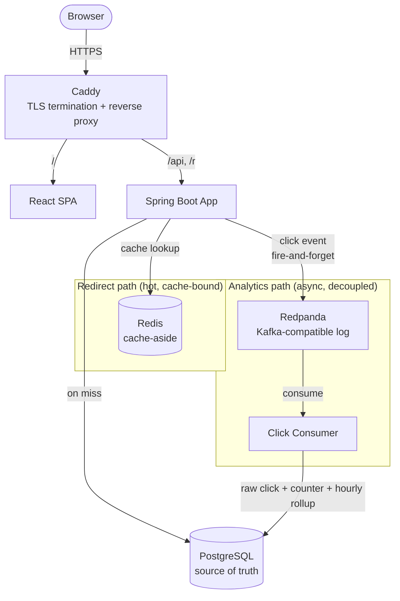
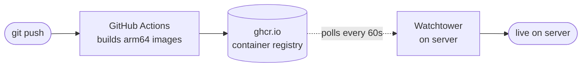

# Linkly

A production-grade URL shortener with real-time click analytics, built to demonstrate the read-heavy / async-write architecture common to payments, ad-tech, and observability systems.

**Live demo:** [linkly.samialsohan.com](https://linkly.samialsohan.com)

Shorten a URL, click it, and watch the analytics update — every redirect is served from cache in single-digit milliseconds while click tracking happens asynchronously through an event pipeline, so analytics load never slows a redirect.

---

## Measured performance

Load-tested with [k6](https://k6.io) under a power-law traffic pattern (80% of traffic to 20% of links), single node, 50 virtual users:

| Metric | Result |
| --- | --- |
| Throughput | **~12,300 redirects/sec** |
| p99 latency | **9.3 ms** |
| Median latency | ~3 ms |
| Success rate | **100%** over 1.11M requests |
| Cache hit rate | ~100% (hot working set resident in Redis) |

> Measured on a single machine with the full stack (app + Postgres + Redis + Redpanda) co-resident, so these are conservative relative to a distributed deployment. The point is the *shape*: the redirect path is cache-bound and never touches the database or blocks on analytics.

---

## Architecture



**The core idea:** the redirect path (`GET /r/{code}`) must be fast, so it does a single Redis lookup and returns a 302. Click tracking is published to Redpanda fire-and-forget and processed by a separate consumer, so analytics processing load — or an analytics outage — never affects redirect latency or availability.

---

## Tech stack

- **Language / framework:** Java 21, Spring Boot 3.5.3
- **Build:** Gradle (Kotlin DSL)
- **Database:** PostgreSQL 16 (source of truth, Flyway-managed schema)
- **Cache:** Redis 7 (cache-aside on the redirect path)
- **Event streaming:** Redpanda (Kafka-API-compatible; chosen for a smaller memory footprint — see below)
- **Frontend:** React 19 (Vite), served as a static SPA
- **Reverse proxy / TLS:** Caddy (automatic Let's Encrypt certificates + renewal)
- **Testing:** JUnit 5, Testcontainers, Awaitility
- **Infra:** Docker Compose, AWS EC2 (Graviton/ARM), GitHub Actions CI/CD, Watchtower auto-deploy

---

## Key design decisions

Each of these was a deliberate trade-off, not a default. This section is the "why," not just the "what."

### Base62 counter-based short codes

Short codes are Base62-encoded values from a dedicated PostgreSQL sequence, rather than random strings, UUIDs, or hashes.

- **UUIDs** produce 22+ character codes even Base64-encoded — not "short."
- **Hashes** reintroduce collision risk without a real upside (most users want a fresh code per submission).
- **Random strings** require a `SELECT`-before-`INSERT` collision check that degrades as the table grows, plus a race window.
- **Counter → Base62** uses the database's atomic sequence: collision-free *by construction*, no collision-check query, and the shortest possible codes for a given ID space (the first ~916M links fit in 5 characters).

The sequence is separate from the row's primary key, so a code can be allocated in a single round-trip without a two-step "insert then update."

### Redis cache-aside with negative caching

Redirects check Redis first; on a miss they read Postgres and populate the cache. Cache failures degrade gracefully to Postgres — Redis can be killed mid-traffic with zero failed redirects (Lettuce command timeout tuned to 500 ms so a cache outage can't stall the redirect path; the default is 60 s).

**Negative caching** stores a short-TTL sentinel for codes that don't exist, absorbing scanner/bot traffic (cache-penetration protection) that would otherwise hit Postgres on every probe. The sentinel value is provably safe because input validation guarantees every real long URL starts with `http`.

### Decoupled click tracking via Redpanda

Incrementing a click counter synchronously on every redirect would turn the fast, cache-bound redirect path into a database write — and serialize the hottest links on a row lock. Instead, each redirect publishes a click event fire-and-forget (`max.block.ms` = 500 ms, so the redirect can't be stalled by the broker) and returns immediately. A separate consumer writes the raw click, increments the counter atomically (`SET count = count + 1`, not read-modify-write), and updates an hourly rollup.

Consumer lag can build without affecting redirects — demonstrated by disabling the consumer, watching lag accumulate via `kafka-consumer-groups --describe`, and confirming redirects stayed at 302 throughout, then draining the backlog on recovery.

### Pre-aggregated hourly rollup

Analytics aggregate *in the database* (never pulling raw rows into the JVM to count). For time-series queries that would scan millions of rows at volume, the consumer maintains an hourly rollup table via `INSERT ... ON CONFLICT DO UPDATE` (atomic upsert, correct under concurrent consumers). Dashboard queries read dozens of rows instead of millions; the raw click log remains the source of truth the rollup is derived from.

### Redpanda instead of Apache Kafka

The production deployment runs on a memory-constrained instance. Apache Kafka's JVM wants ~1 GB+ at rest; Redpanda does the same job in ~600 MB with no JVM, and speaks the Kafka wire protocol — so **zero application code changed** (the Spring Kafka producer/consumer are untouched). The code stays portable to real Kafka; only the broker binary differs.

### `/r/` redirect prefix

Short-code redirects are served under `/r/{code}` rather than a bare `/{code}`. This removes an entire class of routing ambiguity: the reverse proxy routes `/api/*`, `/r/*`, and `/actuator/*` to the backend and everything else to the React SPA — with no fragile regex trying to guess whether a bare path is a short code or a frontend route. Structural separation instead of a maintain-a-list exclusion.

---

## CI/CD

Push-to-deploy with no manual server interaction and **no compilation on the server**:



GitHub Actions cross-builds `linux/arm64` images (the server is ARM/Graviton) and pushes them to the GitHub Container Registry. Watchtower on the server polls for new images and pulls-and-restarts automatically. The server only ever *runs* pre-built images — it never compiles — which keeps a memory-constrained box stable and makes deploys hands-off.

---

## Running locally

```bash
# Start dependencies (Postgres, Redis, Kafka) in Docker
docker compose up -d postgres redis kafka

# Run the app
./gradlew bootRun

# Run the full test suite (spins up real Postgres/Redis/Kafka via Testcontainers)
./gradlew test
```

The frontend:

```bash
cd frontend
npm install
npm run dev
```

To run the entire stack (app + frontend + all dependencies) containerized:

```bash
docker compose -f docker-compose.prod.yml up --build -d
```

---

## API

| Method | Path | Description |
| --- | --- | --- |
| `POST` | `/api/shorten` | Shorten a URL |
| `GET` | `/r/{shortCode}` | Redirect (302) + fire click event |
| `GET` | `/api/urls` | List recent links |
| `GET` | `/api/analytics/{shortCode}` | Click summary for a link |
| `GET` | `/api/analytics/{shortCode}/hourly` | Hourly traffic (from rollup) |
| `GET` | `/api/analytics/{shortCode}/referrers` | Referrer breakdown |
| `GET` | `/api/analytics/top` | Most-clicked links |

---

## Trade-offs & known limitations

Deliberately documented, because knowing a system's limits is part of understanding it.

- **Short codes are enumerable.** Sequential Base62 codes can be walked (`rkg` → `rkh` → …). This is acceptable because links are *public resources* — the same trade-off bit.ly makes. If a code ever guarded a capability (a password-reset link, an unlisted document), enumeration would be an **IDOR** vulnerability, and the fix would be a Feistel network to scramble the counter while preserving collision-free generation.
- **At-least-once click delivery.** The consumer commits its database transaction before the Kafka offset, so a crash in the gap re-delivers an event — a rare duplicate click, not a lost one. Correct trade-off for analytics; exactly-once would need an idempotency key per event.
- **Referrers are not normalized.** `twitter.com/a` and `twitter.com/b` count as distinct referrers. Production analytics would normalize to domain; here the raw value is grouped, with null referrers bucketed as `direct`.
- **Single-node deployment.** The measured throughput is single-node with everything co-resident. The architecture is horizontally scalable (stateless app, partitioned event log, shared cache/DB), but this deployment doesn't demonstrate that.
- **No authentication.** Anyone can shorten any URL. Appropriate for a demo; a real service would add auth and rate limiting.

---

## Author

Built by **Md Samial Hasan Sohan** — [samialsohan.com](https://samialsohan.com)
